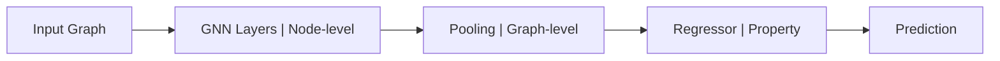

# ACAgraphML Package Documentation

Comprehensive technical documentation for the ACAgraphML package - a complete Graph Machine Learning framework for molecular property prediction.

## 🏗️ Architecture Overview

The ACAgraphML package implements a modular, highly configurable graph machine learning pipeline designed for molecular property prediction tasks. The architecture consists of three main components that can be independently configured and optimized:



### Core Components

1. **GNN Models**: Extract node-level representations using various graph neural network architectures
2. **Pooling Layers**: Aggregate node representations into graph-level embeddings
3. **Regressors**: Map graph embeddings to final property predictions
4. **Pipeline**: Orchestrates the complete workflow with extensive configuration options

## 📦 Package Structure

```
ACAgraphML/
├── Pipeline/                    # Core pipeline components
│   ├── Models/
│   │   ├── GDLPipeline.py      # Main pipeline orchestrator
│   │   ├── GNNmodel.py         # Graph neural network implementations
│   │   ├── Pooling.py          # Graph pooling strategies
│   │   └── Regressor.py        # Regression heads
│   ├── LightningModules/       # PyTorch Lightning integration
│   ├── DataAugmenter.py        # Data augmentation utilities
│   └── TargetNormalizer.py     # Target preprocessing
├── Dataset/                     # Data loading and handling
│   ├── ZINC_Dataset.py         # ZINC dataset loader
│   └── BONDataset.py           # Binary/Object Networks dataset
├── Transforms/                  # Data preprocessing
│   ├── OneHotEncodeFeat.py     # Feature encoding
│   ├── AddMasterNode.py        # Graph augmentation
│   └── ...                     # Additional transforms
├── Plotting/                    # Visualization utilities
├── HGPSL/                      # Hierarchical Graph Pooling (experimental)
└── utils.py                    # Utility functions
```

## 🧠 GNN Models (`GNNmodel.py`)

The GNN component supports 13+ different layer types with consistent interface and extensive configuration options.

### Supported Architectures

| Layer Type        | Edge Features | Description                                  |
| ----------------- | ------------- | -------------------------------------------- |
| `GINEConv`        | ✅            | Graph Isomorphism Network with Edge features |
| `GAT`             | ✅            | Graph Attention Network                      |
| `GATv2`           | ✅            | Graph Attention Network v2                   |
| `SAGE`            | ❌            | GraphSAGE                                    |
| `GCN`             | ❌            | Graph Convolutional Network                  |
| `PNA`             | ✅            | Principal Neighbourhood Aggregation          |
| `TransformerConv` | ✅            | Graph Transformer                            |
| `GINConv`         | ❌            | Graph Isomorphism Network                    |
| `ChebConv`        | ❌            | Chebyshev Spectral Graph Convolution         |
| `ARMAConv`        | ❌            | ARMA Graph Convolution                       |
| `TAGConv`         | ❌            | Topology Adaptive Graph Convolution          |
| `SGConv`          | ❌            | Simplified Graph Convolution                 |
| `GraphConv`       | ❌            | Graph Convolution                            |

### Usage Example

```python
from ACAgraphML.Pipeline.Models.GNNmodel import GNNModel

# Create a GNN with GINEConv layers
gnn = GNNModel(
    c_in=28,                    # Input node features
    c_hidden=128,               # Hidden dimension
    c_out=128,                  # Output dimension
    num_layers=4,               # Number of layers
    layer_name="GINEConv",      # Layer type
    edge_dim=4,                 # Edge feature dimension
    dp_rate=0.1,                # Dropout rate
    use_residual=True,          # Residual connections
    use_layer_norm=True         # Layer normalization
)

# Forward pass
node_embeddings = gnn(x, edge_index, edge_attr)
```

### Configuration Options

```python
from ACAgraphML.Pipeline.Models.GDLPipeline import GNNConfig

gnn_config = GNNConfig(
    hidden_dim=128,
    num_layers=4,
    layer_name="GINEConv",
    dropout_rate=0.1,
    use_residual=True,
    use_layer_norm=True,
    # Layer-specific parameters
    gat_heads=8,                # For GAT layers
    pna_aggregators=['mean', 'max', 'min', 'std'],  # For PNA
    transformer_heads=8,        # For Transformer layers
    # ... additional layer-specific options
)
```

## 🎯 Pooling Strategies (`Pooling.py`)

Convert node-level representations to graph-level embeddings using various aggregation strategies.

### Available Pooling Types

| Type          | Description             | Output Dimension |
| ------------- | ----------------------- | ---------------- |
| `mean`        | Average pooling         | `hidden_dim`     |
| `max`         | Max pooling             | `hidden_dim`     |
| `attentional` | Attention-based pooling | `hidden_dim`     |
| `set2set`     | Set2Set pooling         | `2 * hidden_dim` |

### Usage Example

```python
from ACAgraphML.Pipeline.Models.Pooling import Pooling

# Create attentional pooling
pooling = Pooling(
    pooling_type="attentional",
    hidden_dim=128,
    processing_steps=3  # For Set2Set pooling
)

# Pool node embeddings to graph level
graph_embedding = pooling(node_embeddings, batch)
```

### Configuration

```python
from ACAgraphML.Pipeline.Models.GDLPipeline import PoolingConfig

pooling_config = PoolingConfig(
    pooling_type="attentional",
    processing_steps=3,  # Set2Set parameter
    dropout_rate=0.1
)
```

## 🎪 Regressors (`Regressor.py`)

Map graph embeddings to final property predictions with various architectures optimized for different use cases.

### Regressor Types

| Type            | Complexity | Parameters | Use Case                        |
| --------------- | ---------- | ---------- | ------------------------------- |
| `linear`        | Low        | ~65        | Quick baseline, interpretable   |
| `mlp`           | Medium     | ~17K       | **Recommended** for ZINC        |
| `residual_mlp`  | High       | ~208K      | Deep networks, complex patterns |
| `attention_mlp` | High       | ~150K      | Attention-based prediction      |
| `ensemble_mlp`  | High       | Variable   | Multiple expert networks        |

### Usage Example

```python
from ACAgraphML.Pipeline.Models.Regressor import Regressor

# Create MLP regressor (recommended for ZINC)
regressor = Regressor(
    input_dim=128,
    regressor_type='mlp',
    hidden_dims=[128, 64],      # Hidden layer dimensions
    mlp_dropout=0.15,           # Dropout rate
    normalization='batch',      # Batch normalization
    activation='relu'           # Activation function
)

# Make predictions
predictions = regressor(graph_embeddings)
```

### Configuration

```python
from ACAgraphML.Pipeline.Models.GDLPipeline import RegressorConfig

regressor_config = RegressorConfig(
    regressor_type='mlp',
    hidden_dims=[128, 64],
    mlp_dropout=0.15,
    normalization='batch',
    activation='relu',
    # Ensemble-specific parameters
    num_experts=3,              # For ensemble_mlp
    expert_hidden_dims=[64, 32] # Expert architecture
)
```

## 🚀 GDL Pipeline (`GDLPipeline.py`)

The main pipeline orchestrator that combines all components with extensive configuration options and utility methods.

### Basic Usage

```python
from ACAgraphML import GDLPipeline, GNNConfig, PoolingConfig, RegressorConfig

# Create complete pipeline
pipeline = GDLPipeline(
    node_features=28,
    edge_features=4,
    gnn_config=GNNConfig(
        hidden_dim=128,
        num_layers=4,
        layer_name="GINEConv"
    ),
    pooling_config=PoolingConfig(
        pooling_type="attentional"
    ),
    regressor_config=RegressorConfig(
        regressor_type="mlp",
        hidden_dims=[128, 64]
    ),
    global_dropout=0.1,
    target_mean=0.0,
    target_std=1.0
)

# Forward pass
predictions = pipeline(x, edge_index, edge_attr, batch)
```

### Pre-configured Pipelines

```python
from ACAgraphML.Pipeline.Models.GDLPipeline import (
    create_standard_pipeline,
    create_lightweight_pipeline,
    create_advanced_pipeline
)

# Standard configuration for ZINC
pipeline = create_standard_pipeline(
    node_features=28,
    edge_features=4
)

# Lightweight for quick experiments
pipeline = create_lightweight_pipeline(
    node_features=28,
    edge_features=4
)

# Advanced with attention mechanisms
pipeline = create_advanced_pipeline(
    node_features=28,
    edge_features=4
)
```

### Embedding Extraction

```python
# Extract node-level embeddings
node_embeddings = pipeline.get_node_embeddings(x, edge_index, edge_attr)

# Extract graph-level embeddings
graph_embeddings = pipeline.get_graph_embeddings(x, edge_index, edge_attr, batch)

# Extract all intermediate representations
embeddings = pipeline.get_all_embeddings(x, edge_index, edge_attr, batch)
# Returns: {
#   'node_embeddings': tensor,
#   'graph_embeddings': tensor,
#   'predictions': tensor
# }
```

## ⚡ PyTorch Lightning Integration

The `GDLPipelineLightningModule` provides a complete training framework with advanced features.

### Basic Usage

```python
from ACAgraphML.Pipeline.LightningModules import GDLPipelineLightningModule
import pytorch_lightning as pl

# Create Lightning module
model = GDLPipelineLightningModule(
    node_features=28,
    edge_features=4,
    pipeline_config="standard",  # or "lightweight", "advanced", "custom"
    lr=1e-3,
    weight_decay=1e-4,
    optimizer='adamw',
    lr_scheduler='cosine'
)

# Train with PyTorch Lightning
trainer = pl.Trainer(
    max_epochs=100,
    accelerator='auto',
    devices=1
)
trainer.fit(model, train_dataloader, val_dataloader)
```

### Advanced Configuration

```python
# Custom pipeline configuration
model = GDLPipelineLightningModule(
    node_features=28,
    edge_features=4,
    pipeline_config="custom",
    gnn_config=GNNConfig(
        hidden_dim=256,
        num_layers=5,
        layer_name="GAT",
        gat_heads=8
    ),
    pooling_config=PoolingConfig(
        pooling_type="set2set",
        processing_steps=3
    ),
    regressor_config=RegressorConfig(
        regressor_type="residual_mlp",
        hidden_dims=[256, 128, 64]
    ),
    # Training configuration
    lr=1e-3,
    weight_decay=1e-4,
    optimizer='adamw',
    lr_scheduler='cosine',
    lr_scheduler_params={'T_max': 100, 'eta_min': 1e-6},
    warmup_epochs=5,
    gradient_clip_val=1.0,
    # Monitoring
    monitor_metric='val_mae',
    target_mean=0.0,
    target_std=1.0
)
```

### Pre-configured Models

```python
from ACAgraphML.Pipeline.LightningModules.GDLPipelineLightningModule import (
    create_lightning_standard,
    create_lightning_advanced,
    create_lightning_baseline
)

# Standard configuration
model = create_lightning_standard(
    node_features=28,
    edge_features=4,
    lr=1e-3
)

# Advanced with attention
model = create_lightning_advanced(
    node_features=28,
    edge_features=4,
    lr=1e-3
)
```

## 🗂️ Data Handling

### ZINC Dataset

```python
from ACAgraphML.Dataset import ZINC_Dataset
from ACAgraphML.Transforms import OneHotEncodeFeat

# Load dataset with transforms
transform = OneHotEncodeFeat(num_node_features=28)

train_dataset = ZINC_Dataset.FULL_TRAIN.load(transform=transform)
val_dataset = ZINC_Dataset.FULL_VAL.load(transform=transform)
test_dataset = ZINC_Dataset.FULL_TEST.load(transform=transform)

# Small subsets for quick experiments
train_small = ZINC_Dataset.SMALL_TRAIN.load(transform=transform)
```

### Transforms

```python
from ACAgraphML.Transforms import (
    OneHotEncodeFeat,
    OneHotEdgeFeats,
    AddMasterNode,
    PCAnodeFeatsTransform
)

# Feature encoding
transform = OneHotEncodeFeat(num_node_features=28)

# Add master node for global information
transform = AddMasterNode()

# PCA dimensionality reduction
transform = PCAnodeFeatsTransform(n_components=16)
```

## 🔧 Hyperparameter Optimization

The package is designed for extensive hyperparameter optimization with Optuna integration.

### Key Hyperparameters

```python
# Architecture hyperparameters
'hidden_dim': [64, 128, 256, 512]
'num_layers': [3, 4, 5, 6]
'layer_name': ['GINEConv', 'GAT', 'GATv2', 'SAGE', 'PNA']
'pooling_type': ['mean', 'max', 'attentional', 'set2set']
'regressor_type': ['linear', 'mlp', 'residual_mlp']

# Training hyperparameters
'lr': [1e-4, 5e-4, 1e-3, 5e-3]
'weight_decay': [0, 1e-6, 1e-5, 1e-4, 1e-3]
'dropout_rate': [0.1, 0.15, 0.2, 0.25, 0.3]
'global_dropout': [0.0, 0.1, 0.2]
```

### Optuna Integration

```python
import optuna

def objective(trial):
    # Suggest hyperparameters
    config = {
        'hidden_dim': trial.suggest_categorical('hidden_dim', [64, 128, 256]),
        'num_layers': trial.suggest_int('num_layers', 3, 6),
        'layer_name': trial.suggest_categorical('layer_name', ['GINEConv', 'GAT']),
        'lr': trial.suggest_float('lr', 1e-4, 1e-2, log=True)
    }

    # Create and train model
    model = GDLPipelineLightningModule(
        node_features=28,
        edge_features=4,
        pipeline_config="custom",
        gnn_config=GNNConfig(
            hidden_dim=config['hidden_dim'],
            num_layers=config['num_layers'],
            layer_name=config['layer_name']
        ),
        lr=config['lr']
    )

    # Train and return validation metric
    trainer = pl.Trainer(max_epochs=50, logger=False)
    trainer.fit(model, train_loader, val_loader)

    return trainer.callback_metrics['val_mae'].item()

# Run optimization
study = optuna.create_study(direction='minimize')
study.optimize(objective, n_trials=100)
```

## 🛠️ Utilities

### Model Analysis

```python
from ACAgraphML.utils import (
    get_model_memory_usage,
    get_comprehensive_model_info,
    print_model_summary,
    measure_inference_latency
)

# Analyze model
model_info = get_comprehensive_model_info(model, include_hparams=True)
print(f"Total Parameters: {model_info['model/total_parameters']}")
print(f"Memory Usage: {model_info['model/memory_mb']:.2f} MB")

# Measure performance
latency_info = measure_inference_latency(model, create_sample_input)
print(f"Inference Latency: {latency_info['mean_latency_ms']:.2f} ms")
```

### Model Saving/Loading

```python
# Save pipeline configuration
pipeline.save_config('model_config.yaml')

# Load pipeline from configuration
pipeline = GDLPipeline.from_config('model_config.yaml')

# Lightning module checkpointing
trainer = pl.Trainer(
    callbacks=[
        pl.callbacks.ModelCheckpoint(
            monitor='val_mae',
            mode='min',
            save_top_k=1
        )
    ]
)
```

## 🎨 Visualization

```python
from ACAgraphML.Plotting import plotGraph, plot_training_curves

# Visualize graphs
import matplotlib.pyplot as plt
fig, ax = plt.subplots()
plotGraph(data, title="Sample Molecule", ax=ax)

# Plot training progress
plot_training_curves(train_losses, val_losses)
```

## 🧪 Testing

The package includes comprehensive tests covering all components:

```python
# Run all tests
python -m pytest tests/ -v

# Test specific components
python -m pytest tests/test_GDLPipeline.py -v
python -m pytest tests/test_GNNmodel.py -v
python -m pytest tests/test_Regressor.py -v

# Integration tests
python -m pytest tests/test_GDLPipeline_integration.py -v

# Benchmark tests
python -m pytest tests/test_GDLPipeline_benchmark.py -v
```

## 🔬 Experimental Components

### HGPSL (Hierarchical Graph Pooling with Structure Learning)

An experimental implementation of hierarchical pooling:

```python
from ACAgraphML.HGPSL import HGPSLModel

# Note: This is experimental and may not be fully integrated
model = HGPSLModel(
    input_dim=28,
    hidden_dim=128,
    output_dim=1
)
```

## 🚨 Common Issues and Solutions

### Memory Issues

- Reduce batch size or model dimensions
- Use gradient checkpointing: `model.gradient_checkpointing = True`
- Enable mixed precision training

### Training Instability

- Lower learning rate
- Increase warmup epochs
- Add gradient clipping: `gradient_clip_val=1.0`

### Poor Performance

- Try different GNN architectures (GINEConv often works well)
- Experiment with pooling strategies (attentional pooling is robust)
- Increase model capacity (hidden_dim, num_layers)

## 📈 Performance Guidelines

### ZINC Dataset Benchmarks

| Configuration | Val MAE    | Parameters | Memory |
| ------------- | ---------- | ---------- | ------ |
| Lightweight   | ~0.4-0.6   | ~50K       | ~200MB |
| Standard      | ~0.2-0.4   | ~200K      | ~500MB |
| Advanced      | ~0.15-0.25 | ~1M+       | ~1GB+  |

### Optimization Tips

1. **Start with standard configuration** for baseline
2. **Use attentional pooling** for robust performance
3. **GINEConv + MLP regressor** is often optimal for ZINC
4. **Batch normalization** helps training stability
5. **Residual connections** allow deeper networks

## 📝 Contributing

To contribute to the package:

1. Follow the existing code structure and naming conventions
2. Add comprehensive docstrings and type hints
3. Include unit tests for new functionality
4. Update this documentation for new features
5. Ensure all tests pass before submitting

---

This documentation covers the core functionality of the ACAgraphML package. For specific use cases and advanced examples, refer to the `examples/` directory and the main project notebooks.
